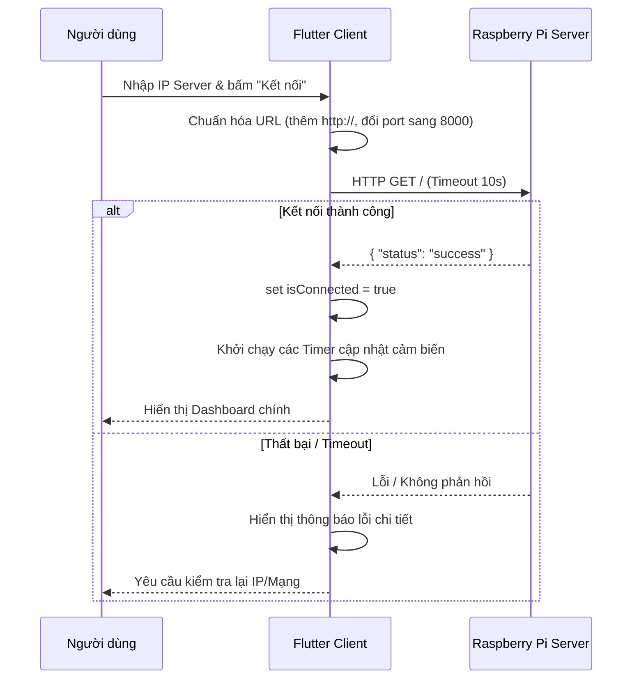

# Báo cáo Kỹ thuật - IoT Smart Home App (Flutter)

Chào mừng bạn đến với Báo cáo Kỹ thuật (Technical Report) của dự án **IoT App** - Ứng dụng điều khiển và giám sát thiết bị nhà thông minh (Smart Home) được xây dựng trên nền tảng **Flutter**. Tài liệu này cung cấp cái nhìn chi tiết về kiến trúc mã nguồn, các công nghệ sử dụng, giải thích chi tiết chức năng của từng module/file và luồng hoạt động của hệ thống.

---

## 1. Mô tả Sơ lược Dự án

**IoT App** là một ứng dụng Dashboard đa nền tảng được phát triển bằng Flutter. Ứng dụng này đóng vai trò giao diện điều khiển trung tâm (Client) kết nối với một Raspberry Pi hoặc Backend server (thông qua giao thức HTTP/REST API).

Ứng dụng cho phép người dùng:

- **Thiết lập kết nối động** tới địa chỉ IP hoặc domain của hệ thống IoT.
- **Giám sát thời gian thực** các thông số môi trường từ cảm biến (Nhiệt độ, Độ ẩm) và phát hiện rò rỉ khí độc hại (Gas).
- **Điều khiển trực tiếp** các thiết bị đầu ra trong nhà bao gồm:
  - Hệ thống đèn LED chiếu sáng theo từng phòng.
  - Cửa gara xe thông minh điều khiển bằng động cơ bước (Stepper Motor).
  - Cửa chính (Front Door) và cửa phụ (Back Door) điều khiển bằng động cơ Servo.
  - Màn hình LCD hiển thị thông điệp vật lý.
- **Tương tác bằng giọng nói** thông qua Trợ lý Voice AI tích hợp, cho phép ra lệnh cho nhà thông minh bằng lời nói và nhận phản hồi phát lại bằng âm thanh.

---

## 2. Công nghệ Sử dụng

Dự án áp dụng các công nghệ, kỹ thuật phát triển phần mềm hiện đại nhằm đảm bảo hiệu năng và khả năng chạy đa nền tảng mượt mà:

- **Flutter SDK (`^3.10.8`) & Dart SDK**: Xây dựng UI/UX đáp ứng, hỗ trợ đa nền tảng (Android, iOS, Web, Windows, macOS, Linux).
- **Kiến trúc Component-based**: Tách biệt hoàn toàn giao diện người dùng thành các Widget độc lập, dễ bảo trì và tái sử dụng.
- **REST API qua HTTP**: Sử dụng các phương thức `GET` và `POST` với dữ liệu định dạng JSON để truyền nhận trạng thái thiết bị.
- **Dynamic Base URL**: Cho phép cấu hình địa chỉ IP máy chủ Raspberry Pi lúc runtime mà không cần build lại ứng dụng.
- **Dart Conditional Imports**: Kỹ thuật import điều kiện của Dart (`if (dart.library.html)`) giúp phân tách các dịch vụ sử dụng tệp tin vật lý (chỉ chạy trên Mobile/Desktop) và các dịch vụ chạy trực tiếp trên trình duyệt Web (chạy qua Web Audio API & Byte Array).
- **Web Audio & MediaRecorder API**: Thu âm giọng nói trực tiếp trên Web.
- **State Management**: Sử dụng State cục bộ kết hợp với cơ chế phản hồi Widget độc lập (`StatefulBuilder`, `StateUpdater`) tối ưu hiệu năng kết xuất đồ họa (render) trong Flutter.
- **Giao diện đa sắc thái**: Tích hợp Dark/Light Theme chuyển đổi mượt mà phù hợp với môi trường sử dụng của người dùng.

---

## 3. Danh sách Dependency kèm Chức năng

Các thư viện phụ thuộc của dự án được định nghĩa trong [pubspec.yaml](file:./pubspec.yaml):

| Tên Dependency              | Phiên bản | Chức năng chi tiết trong dự án                                                                              |
| :-------------------------- | :-------- | :---------------------------------------------------------------------------------------------------------- |
| **`flutter`**               | _SDK_     | Framework cốt lõi cung cấp các Widget và công cụ dựng UI.                                                   |
| **`cupertino_icons`**       | `^1.0.8`  | Bộ icon phong cách thiết kế Cupertino (iOS) phục vụ giao diện.                                              |
| **`http`**                  | `^1.6.0`  | Thư viện tạo các request HTTP GET/POST và Multipart gửi file âm thanh lên server AI.                        |
| **`dio`**                   | `^5.9.2`  | Client HTTP nâng cao hỗ trợ Interceptors và quản lý request (đã được cấu hình trong dependency).            |
| **`path_provider`**         | `^2.0.15` | Cung cấp đường dẫn thư mục tạm thời (`getTemporaryDirectory()`) để lưu file âm thanh trên Mobile/Desktop.   |
| **`permission_handler`**    | `^12.0.3` | Quản lý và yêu cầu quyền truy cập micro (`Permission.microphone`) thời điểm chạy (runtime).                 |
| **`shared_preferences`**    | `^2.5.5`  | Lưu trữ cấu hình cục bộ của ứng dụng (như địa chỉ IP kết nối hoặc tùy chọn giao diện).                      |
| **`intl`**                  | `^0.20.2` | Định dạng thời gian hiển thị (`DateFormat`) của các cảnh báo rò rỉ khí gas nguy hiểm.                       |
| **`audioplayers`**          | `^6.7.0`  | Phát file âm thanh phản hồi của AI trợ lý (hỗ trợ phát từ file cục bộ hoặc link trực tiếp URL).             |
| **`record`**                | `^6.2.1`  | Thực hiện thu âm âm thanh từ micro trên thiết bị Android, iOS, Windows, macOS, Linux sang định dạng `.wav`. |
| **`flutter_lints`** _(Dev)_ | `^6.0.0`  | Bộ kiểm tra lỗi cú pháp và khuyến nghị chuẩn hóa code Flutter.                                              |

---

## 4. Kiến trúc Dự án & Mô tả Chức năng Từng File

Mã nguồn chính của ứng dụng nằm hoàn toàn trong thư mục `lib/`:

```text
lib/
├── main.dart                       # Điểm khởi chạy ứng dụng & Quản lý màn hình chính SmartHomeScreen
├── modules/                         # Thư mục chứa các component giao diện (UI Components)
│   ├── display_control.dart        # Ô nhập liệu và gửi thông điệp lên màn hình LCD
│   ├── gas_alert_banner.dart       # Banner hiển thị cảnh báo khi phát hiện rò rỉ Gas
│   ├── gas_warning_bar.dart        # Thanh cảnh báo Gas động có màu sắc thay đổi theo thời gian
│   ├── led_control.dart            # Widget điều khiển đèn LED Phòng khách
│   ├── sensor_card.dart            # Card hiển thị thông số cảm biến Nhiệt độ, Độ ẩm
│   ├── servo_control.dart          # Giao diện đóng/mở servo cửa trước và cửa sau
│   ├── stepper_control.dart        # Bảng điều khiển cửa gara xe (Động cơ bước Stepper)
│   └── url_setup.dart              # Giao diện thiết lập địa chỉ kết nối đến Raspberry Pi
└── services/                        # Thư mục xử lý kết nối API và phần cứng ngoại vi
    ├── api_service.dart            # Lớp dịch vụ API gốc (khai báo các endpoint kết nối chung)
    ├── api_service_io.dart         # Triển khai API cho nền t năng Native Mobile/Desktop (dùng File)
    ├── api_service_web.dart        # Triển khai API cho nền tảng Web (dùng Bytes stream)
    ├── web_audio_recorder.dart     # Service thu âm trên Web sử dụng MediaRecorder API của trình duyệt
    └── web_audio_recorder_stub.dart# File trung gian để tránh lỗi biên dịch thư viện Web trên Native
```

### Mô tả chi tiết chức năng từng file:

#### 1. File điều phối trung tâm

- **[main.dart](file:///d:/LocalProject/Flutter/iot_app/iot_app/lib/main.dart)**: Khởi chạy ứng dụng (`void main()`). Chứa Widget chính `SmartHomeScreen`. File này quản lý toàn bộ vòng đời ứng dụng, thiết lập kết nối, kích hoạt các timer cập nhật dữ liệu tự động định kỳ, xử lý thu âm giọng nói, xử lý chuyển đổi giao diện sáng/tối (Dark/Light mode) và điều phối toàn bộ widget thành phần bên dưới.

#### 2. Các Widget giao diện (`lib/modules/`)

- **[url_setup.dart](file:///d:/LocalProject/Flutter/iot_app/iot_app/lib/modules/url_setup.dart)**: Giao diện nhập URL/IP. Hỗ trợ hiển thị vòng xoay tải (`CircularProgressIndicator`) và cảnh báo lỗi kết nối nếu không tìm thấy máy chủ.
- **[sensor_card.dart](file:///d:/LocalProject/Flutter/iot_app/iot_app/lib/modules/sensor_card.dart)**: Thể hiện thông tin cảm biến một cách trực quan, sử dụng màu sắc phân biệt giữa Nhiệt độ (Đỏ/Cam) và Độ ẩm (Xanh).
- **[led_control.dart](file:///d:/LocalProject/Flutter/iot_app/iot_app/lib/modules/led_control.dart)**: Quản lý switch bật/tắt riêng biệt cho đèn LED phòng khách.
- **[stepper_control.dart](file:///d:/LocalProject/Flutter/iot_app/iot_app/lib/modules/stepper_control.dart)**: Cho phép lựa chọn chiều chuyển động cửa gara (Mở/Đóng) và chọn hệ số bước (1 đến 4 lần chuyển động).
- **[servo_control.dart](file:///d:/LocalProject/Flutter/iot_app/iot_app/lib/modules/servo_control.dart)**: Thiết lập bảng điều khiển cửa trước và cửa sau riêng biệt thông qua động cơ servo.
- **[display_control.dart](file:///d:/LocalProject/Flutter/iot_app/iot_app/lib/modules/display_control.dart)**: Cung cấp ô văn bản để gửi chuỗi ký tự hiển thị lên màn hình LCD 16x2 hoặc 20x4 của hệ thống.
- **[gas_alert_banner.dart](file:///d:/LocalProject/Flutter/iot_app/iot_app/lib/modules/gas_alert_banner.dart)**: Widget Card màu đỏ nổi bật xuất hiện lập tức khi phát hiện khí gas vượt ngưỡng an toàn.
- **[gas_warning_bar.dart](file:///d:/LocalProject/Flutter/iot_app/iot_app/lib/modules/gas_warning_bar.dart)**: Widget nâng cao tự động tính toán thời gian rò rỉ khí gas. Nó thay đổi màu sắc từ Vàng (mới rò rỉ < 5 phút) sang Cam (5 - 10 phút) và Đỏ (trên 10 phút) để kích thích sự chú ý của người dùng.

#### 3. Dịch vụ kết nối (`lib/services/`)

- **[api_service.dart](file:///d:/LocalProject/Flutter/iot_app/iot_app/lib/services/api_service.dart)**: Định nghĩa interface của `ApiService`, cấu hình Base URL mặc định `http://10.198.184.243:8000`.
- **[api_service_io.dart](file:///d:/LocalProject/Flutter/iot_app/iot_app/lib/services/api_service_io.dart)**: Triển khai API cho môi trường Native (Android/iOS/Desktop). Khi người dùng ra lệnh bằng giọng nói, tệp tin âm thanh `.wav` trên ổ cứng sẽ được đọc và tải lên server qua Multipart File.
- **[api_service_web.dart](file:///d:/LocalProject/Flutter/iot_app/iot_app/lib/services/api_service_web.dart)**: Triển khai API cho Web. Trên môi trường trình duyệt, không có quyền truy cập trực tiếp vào hệ thống tệp cục bộ (`File` của `dart:io`), do đó tệp tin âm thanh được truyền nhận dưới dạng mảng byte (`List<int>`) trong RAM.
- **[web_audio_recorder.dart](file:///d:/LocalProject/Flutter/iot_app/iot_app/lib/services/web_audio_recorder.dart)**: Sử dụng các đối tượng trình duyệt như `MediaRecorder`, `Blob`, `FileReader` của thư viện `dart:html` để thu âm và chuyển đổi sang mảng byte.
- **[web_audio_recorder_stub.dart](file:///d:/LocalProject/Flutter/iot_app/iot_app/lib/services/web_audio_recorder_stub.dart)**: Lớp giả lập của `WebAudioRecorder` để trình biên dịch Flutter không báo lỗi thiếu thư viện `dart:html` khi đóng gói ứng dụng cho Android hoặc iOS.

---

## 5. Danh sách Chức năng & Workflow Chi tiết

### Chức năng 1: Cấu hình và Kiểm tra Kết nối (URL Connection)

- **Thao tác**: Người dùng nhập địa chỉ IP/URL của thiết bị và nhấn nút "Kết nối" (Connect).
- **Luồng hoạt động dưới nền (Workflow)**:
  1. Người dùng kích hoạt hành động kết nối qua Widget [url_setup.dart](file:///d:/LocalProject/Flutter/iot_app/iot_app/lib/modules/url_setup.dart).
  2. Hàm `_testConnection` trong [main.dart](file:///d:/LocalProject/Flutter/iot_app/iot_app/lib/main.dart) kiểm tra định dạng URL (thêm tiền tố `http://` nếu thiếu, thay đổi port mặc định thành `8000` nếu phát hiện kết nối cổng `80` hoặc `443`).
  3. Gửi request `GET /` với thời gian chờ tối đa (timeout) là 10 giây.
  4. Nếu server trả về JSON có khóa `{ "status": "success" }`, biến trạng thái `isConnected` chuyển sang `true`, lưu cấu hình và khởi chạy các Timer tự động làm mới cảm biến.



### Chức năng 2: Giám sát Cảm biến Môi trường (Nhiệt độ & Độ ẩm)

- **Thao tác**: Hiển thị tự động trên màn hình chính, hoặc nhấn nút Floating Action Button (FAB) Refresh ở góc dưới bên phải.
- **Workflow**:
  1. Khi đã kết nối thành công, app kích hoạt một `Timer.periodic` chạy mỗi **2 giây** gọi hàm `_refreshSensors()`.
  2. Gửi request `GET /dht` đến Raspberry Pi.
  3. Server trả về kết quả dạng: `{ "temp": 26.5, "humi": 60 }`.
  4. Client phân tách và cập nhật lên hai Widget [sensor_card.dart](file:///d:/LocalProject/Flutter/iot_app/iot_app/lib/modules/sensor_card.dart) tương ứng với nhiệt độ và độ ẩm trên giao diện.

### Chức năng 3: Hệ thống Cảnh báo rò rỉ khí Gas động

- **Thao tác**: Hệ thống giám sát tự động ngầm. Người dùng có thể nhấn nút "X" trên banner để ẩn cảnh báo tạm thời.
- **Workflow**:
  1. Một `Timer.periodic` tốc độ cao chạy định kỳ mỗi **800ms** gọi hàm `_refreshGasStatus()`.
  2. Gửi request `GET /gas` đến máy chủ.
  3. Phản hồi trả về chứa giá trị cảm biến gas:
     - Nếu `value == 0.0`: Trạng thái nguy hiểm kích hoạt (`isGasAlert = true`, `isGasAlertCritical = true`). Ghi nhận mốc thời gian phát hiện thông qua `intl`.
     - Nếu `value == 1.0` (ngưỡng an toàn trở lại) nhưng trước đó có cảnh báo: `isGasAlertCritical` chuyển sang `false` (gas đã ổn định tạm thời nhưng banner vẫn hiển thị cho đến khi người dùng tắt thủ công).
  4. Banner [gas_warning_bar.dart](file:///d:/LocalProject/Flutter/iot_app/iot_app/lib/modules/gas_warning_bar.dart) được đưa lên hàng đầu: Timer bên trong widget này sẽ kiểm tra thời gian trôi qua so với mốc phát hiện rò rỉ gas để tự đổi màu cảnh báo (Vàng $\rightarrow$ Cam $\rightarrow$ Đỏ) giúp người dùng nhận thức mức độ khẩn cấp.

### Chức năng 4: Điều khiển Đèn LED chiếu sáng

- **Thao tác**: Người dùng gạt các nút Switch tương ứng với các phòng: Phòng khách, Phòng ngủ, Phòng ăn, Nhà vệ sinh, Gara xe.
- **Workflow**:
  1. Nhấn nút gạt trigger sự kiện switch trong Widget [led_control.dart](file:///d:/LocalProject/Flutter/iot_app/iot_app/lib/modules/led_control.dart) hoặc helper `_buildLedItem`.
  2. Client gửi request `POST /led/{room}` (trong đó `{room}` là tên phòng tương ứng) với payload JSON dạng `{ "status": 1 }` (bật) hoặc `{ "status": 0 }` (tắt).
  3. Server Raspberry Pi tiếp nhận, điều khiển xuất mức điện áp HIGH/LOW trên chân GPIO tương ứng để điều khiển rơ-le/đèn và trả về HTTP status `200`.

### Chức năng 5: Điều khiển Cửa Gara xe (Động cơ bước Stepper)

- **Thao tác**: Người dùng chọn hành động "Mở" hoặc "Đóng", lựa chọn số lần quay (1 đến 4) trên bảng điều khiển và nhấn "Gửi lệnh".
- **Workflow**:
  1. Giao diện thiết lập trạng thái bận `isStepperBusy = true` để khóa tạm thời nút bấm, tránh xung đột lệnh.
  2. Client gửi request `POST /stepper/control` kèm payload `{ "action": "open" | "close", "times": 1..4 }`.
  3. Server tiếp nhận lệnh, điều khiển Driver động cơ bước xoay cửa Gara theo chiều và số vòng tương ứng. Sau khi động cơ hoàn tất chuyển động, server trả về phản hồi thành công.
  4. Client nhận phản hồi, mở khóa trạng thái bận, hiển thị thông báo kết quả qua SnackBar và gọi `GET /stepper/status` để hiển thị trạng thái cửa mới nhất (ví dụ: OPEN / CLOSED).

### Chức năng 6: Điều khiển Đóng/Mở Cửa (Động cơ Servo)

- **Thao tác**: Người dùng nhấn nút "Mở" (Open) hoặc "Đóng" (Close) tại mục Cửa trước hoặc Cửa sau.
- **Workflow**:
  1. Khóa tạm thời tương tác điều khiển cửa (`isServoBusy = true`).
  2. Client gửi request `POST /servo/{door}/{action}` (Ví dụ: `POST /servo/front/open`) với payload trống.
  3. Server điều khiển động cơ servo xoay góc tương ứng (ví dụ: quay 90 độ để mở cửa, quay về 0 độ để đóng cửa).
  4. Trả về mã HTTP status `200` khi hoàn thành. Client mở khóa giao diện và cập nhật trạng thái cửa.

### Chức năng 7: Gửi Văn bản lên Màn hình LCD

- **Thao tác**: Người dùng nhập chuỗi thông điệp vào TextField "Màn hình LCD" và nhấn biểu tượng gửi.
- **Workflow**:
  1. Widget [display_control.dart](file:///d:/LocalProject/Flutter/iot_app/iot_app/lib/modules/display_control.dart) thu thập văn bản từ controller.
  2. Gửi request `POST /lcd` với nội dung JSON `{ "message": "Nội dung cần hiển thị" }`.
  3. Server tiếp nhận và ghi dữ liệu ra màn hình LCD vật lý.
  4. Khi gửi thành công, Client tự động xóa trắng ô nhập liệu để sẵn sàng cho lần gửi tiếp theo.

### Chức năng 8: Trợ lý giọng nói AI (Voice AI Assistant)

- **Thao tác**: Người dùng bấm vào biểu tượng Micro trên AppBar để mở Bottom Sheet ghi âm. Nhấn "Bắt đầu" để thu âm lệnh nói và nhấn "Dừng" để gửi lệnh. Nhấn "Phát trả lời" để nghe phản hồi bằng giọng nói của AI.
- **Workflow khác biệt giữa Web và Native**:

```text
[Luồng xử lý trên Mobile/Desktop (Native I/O)]
1. Yêu cầu quyền Micro -> Thu âm định dạng WAV -> Lưu file vật lý 'request_audio.wav' trong thư mục tạm.
2. Đọc file vật lý dưới dạng luồng dữ liệu -> POST /ai/process-voice (Multipart Request).
3. Nhận phản hồi JSON -> Tải file âm thanh phản hồi từ server lưu thành 'response_audio.mp3'.
4. Người dùng bấm "Phát trả lời" -> Sử dụng DeviceFileSource phát tệp mp3 cục bộ.

[Luồng xử lý trên Trình duyệt (Web)]
1. Yêu cầu quyền Micro qua MediaRecorder -> Ghi âm lưu trực tiếp vào bộ nhớ RAM dưới dạng byte array (List<int>).
2. Chuyển đổi byte array thành Multipart File -> POST /ai/process-voice.
3. Nhận phản hồi JSON chứa đường dẫn audio phát trực tiếp (audio_url).
4. Người dùng bấm "Phát trả lời" -> Sử dụng UrlSource phát nhạc trực tuyến trực tiếp từ server mà không cần ghi file.
```

---

## 6. Các Lưu ý Quan trọng khi Phát triển & Triển khai

> [!WARNING]
> **Bảo mật mạng nội bộ**: Dự án hiện không tích hợp hệ thống xác thực (AccessToken, JWT, Session) khi gọi API. Bất kỳ thiết bị nào trong cùng mạng LAN đều có thể gửi request điều khiển thiết bị. Khuyến nghị chỉ triển khai hệ thống trong mạng nội bộ được bảo vệ bởi tường lửa.

> [!IMPORTANT]
> **Tương thích đa nền tảng**: Tránh import trực tiếp `dart:io` hoặc `dart:html` trong các file dùng chung. Hãy sử dụng cơ chế **Conditional Imports** giống như cách triển khai trong [main.dart](file:///d:/LocalProject/Flutter/iot_app/iot_app/lib/main.dart#L4-L5) để đảm bảo ứng dụng có thể build thành công trên cả Web và thiết bị di động.

- **Tần suất cập nhật Gas**: Tần suất cập nhật khí gas cực kỳ nhanh (800ms) để đảm bảo độ nhạy cảnh báo cháy nổ. Việc này tiêu tốn nhiều tài nguyên mạng hơn, do đó server Raspberry Pi cần được tối ưu hóa xử lý bất đồng bộ để tránh bị nghẽn request.
- **Cổng giao tiếp**: Cổng dịch vụ mặc định của Server IoT luôn là **`8000`**. Nếu bạn đổi cổng ở phía backend, hãy cập nhật lại hàm chuẩn hóa URL trong `main.dart` hoặc định cấu hình thủ công chính xác khi thiết lập IP.

---

## 7. Cách Chạy và Cài đặt Dự án

### Yêu cầu Hệ thống (Prerequisites)

Trước khi cài đặt, hãy đảm bảo máy tính phát triển của bạn đã cài đặt các công cụ sau:

- **Flutter SDK**: Phiên bản `^3.10.8` trở lên (Tải về tại [Trang chủ Flutter](https://flutter.dev/docs/get-started/install)).
- **Dart SDK**: Được cài đặt đi kèm với Flutter.
- **Git**: Sử dụng để clone mã nguồn dự án.
- **IDE**: Android Studio, VS Code hoặc IntelliJ IDEA đã cài đặt sẵn Flutter và Dart plugins.

Kiểm tra tính sẵn sàng của môi trường bằng lệnh:

```bash
flutter doctor
```

### Bước 1: Clone dự án về máy cục bộ

```bash
git clone https://github.com/Dathless/Flutter_IoT.git
cd iot_app
```

### Bước 2: Tải và cài đặt các thư viện (Dependencies)

Chạy lệnh sau tại thư mục gốc của dự án để tải về toàn bộ thư viện cần thiết:

```bash
flutter pub get
```

### Bước 3: Khởi chạy ứng dụng theo nền tảng

#### Chạy trên thiết bị Android

- **Thiết bị thật**: Bật tùy chọn nhà phát triển (Developer Options) và gỡ lỗi qua USB (USB Debugging) trên điện thoại, kết nối điện thoại với máy tính qua cáp USB, sau đó chạy:
  ```bash
  flutter run
  ```
- **Thiết bị ảo (Emulator)**: Mở trình giả lập Android từ Android Studio và chạy:
  ```bash
  flutter run
  ```

#### Chạy trên Trình duyệt Web (Web Browser)

Để khởi chạy ứng dụng trực tiếp trên trình duyệt Google Chrome:

```bash
flutter run -d chrome
```

#### Chạy ứng dụng Desktop (Desktop Application)

Tùy thuộc vào hệ điều hành bạn đang phát triển, hãy chạy câu lệnh tương ứng (yêu cầu cài đặt các công cụ build Native C++ tương ứng như Visual Studio trên Windows hoặc Xcode trên macOS):

- **Windows**:
  ```bash
  flutter run -d windows
  ```
- **macOS**:
  ```bash
  flutter run -d macos
  ```
- **Linux**:
  ```bash
  flutter run -d linux
  ```

---

## 8. Tài liệu Tham khảo

- [Tài liệu chính thức của Flutter](https://docs.flutter.dev/)
- [Tài liệu ngôn ngữ Dart](https://dart.dev/)
- [Tài liệu đặc tả API Smart Home IoT](file:///d:/LocalProject/Flutter/iot_app/iot_app/API.md) - Đặc tả các Endpoint của hệ thống Raspberry Pi.
- [Flutter Platform Channels Guide](https://docs.flutter.dev/development/platform-integration/platform-channels) - Hướng dẫn tích hợp phần cứng của Flutter.
